# Full UML Diagram for the PC Builder Project

This diagram captures the core domain model, service layer, and compatibility/build-fix flow for the project.

```mermaid
classDiagram
    direction LR

    class User {
        +int user_id
        +str username
        +str password
        +str email
        +str profile_picture
        +bool is_admin
        +str country
        +datetime created_at
        +bool is_active
        +datetime last_active
        +set_password(raw)
        +check_password(raw)
        +get_id()
    }

    class Build {
        +int build_id
        +int user_id
        +datetime created_at
        +str name
        +str component_ids
        +float total_price
        +str compatibility_status
    }

    class Activity {
        +int activity_id
        +int user_id
        +str action_type
        +str description
        +datetime timestamp
        +log_activity(user_id, action_type, description)
        +get_recent_activities(user_id, limit=10)
    }

    class Component {
        +int component_id
        +str name
        +str category
        +str brand
        +str external_id
        +JSON specs
        +JSON compatibility
        +float price
        +int performance_score
        +str image_url
        +str description
        +links
        +to_dict()
        +get_details()
    }

    class Link {
        +int link_id
        +int component_id
        +str store
        +str url
        +bool verified
        +float price
        +normalized_url()
        +to_dict()
    }

    class ComponentSpecs {
        +dict specs
        +to_dict()
    }

    class CPUSpecs
    class GPUSpecs
    class RAMSpecs
    class StorageSpecs
    class PSUSpecs
    class MotherboardSpecs
    class CoolingSpecs
    class CaseSpecs

    ComponentSpecs <|-- CPUSpecs
    ComponentSpecs <|-- GPUSpecs
    ComponentSpecs <|-- RAMSpecs
    ComponentSpecs <|-- StorageSpecs
    ComponentSpecs <|-- PSUSpecs
    ComponentSpecs <|-- MotherboardSpecs
    ComponentSpecs <|-- CoolingSpecs
    ComponentSpecs <|-- CaseSpecs

    class BaseComponent {
        +Component _component
        +ComponentSpecs _specs
        +specs
        +to_dict()
    }

    class CPUComponent
    class GPUComponent
    class RAMComponent
    class StorageComponent
    class PSUComponent
    class MotherboardComponent
    class CoolingComponent
    class CaseComponent

    BaseComponent <|-- CPUComponent
    BaseComponent <|-- GPUComponent
    BaseComponent <|-- RAMComponent
    BaseComponent <|-- StorageComponent
    BaseComponent <|-- PSUComponent
    BaseComponent <|-- MotherboardComponent
    BaseComponent <|-- CoolingComponent
    BaseComponent <|-- CaseComponent

    class ComponentFactory {
        +create(component_obj)
        +register(category, component_class)
    }

    class ComponentRepository {
        +get_all()
        +get_by_id(component_id)
        +get_by_name(name)
        +get_by_category(category)
        +search_by_name(search_term)
        +search_by_brand(brand)
        +get_by_price_range(min, max)
        +get_by_spec(category, spec_key, spec_value)
    }

    class BaseService {
        -dict _cache
        -list _error_log
        +execute(*args, **kwargs)
        +_log_error(error_msg, context)
        +_cache_result(key, value, ttl=None)
        +_get_cached(key)
        +get_errors()
        +clear_errors()
        +clear_cache()
    }

    class DataAccessService
    class BusinessLogicService {
        +validate_input(data, required_fields)
        +sanitize_data(data)
    }

    class ActivityService {
        +execute(activity_type, user_id, description)
        +_create_activity(user_id, activity_type, description)
        +log_profile_update(user_id, changes)
        +log_password_change(user_id)
        +log_build_created(user_id, build_name)
        +log_build_updated(user_id, build_name)
        +log_build_deleted(user_id, build_name)
        +log_compatibility_check(user_id, build_name, status)
        +log_compatibility_fix(user_id, build_name)
        +log_build_shared(user_id, build_name, shared_with)
        +log_comparison(user_id, compared_items, comparison_type)
        +log_questionnaire_completed(user_id)
        +log_custom_activity(user_id, action_type, description)
        +get_user_activities(user_id, limit)
        +get_activity_stats(user_id)
        +clear_user_activities(user_id)
    }

    class CompatibilityService {
        +evaluate_build(parts_input)
    }

    class ComponentMatcher {
        +get_component(name)
        +detect_components(parts_input)
    }

    class ComponentLoader {
        +load()
    }

    class PerformanceAnalyzer {
        +cpu_score(name_or_component)
        +gpu_score(name_or_component)
        +tier(cpu_s, gpu_s)
        +resolution(gpu_s)
        +fps(cpu_s, gpu_s)
        +bottleneck(cpu_s, gpu_s)
        +upgrades(gpu_s, cpu_s=None, has_gpu=False, ram_capacity=0, psu_w=0)
    }

    class CompatibilityChecker {
        +check(groups)
    }

    class Utils {
        +norm(text)
        +num(value)
        +split(parts_input)
    }

    class BuildFixService {
        +fix_build(parts, answers=None)
    }

    class QuestionnaireService {
        +get_build_recommendation(answers)
    }

    class CacheUtil {
        +memoize(timeout)
        +clear_cache(prefix=None)
        +get_cached_keys(prefix=None)
    }

    User "1" -- "0..*" Build : owns
    Component "1" -- "0..*" Link : has
    ComponentFactory ..> BaseComponent : creates
    ComponentRepository --> Component : queries
    ComponentRepository ..> ComponentFactory : wraps
    ActivityService --|> BusinessLogicService
    BusinessLogicService --|> BaseService
    DataAccessService --|> BaseService
    CompatibilityService ..> ComponentMatcher
    CompatibilityService ..> CompatibilityChecker
    CompatibilityService ..> PerformanceAnalyzer
    CompatibilityService ..> Utils
    ComponentMatcher ..> ComponentLoader
    ComponentMatcher ..> Utils
    ComponentLoader ..> CacheUtil
    BuildFixService ..> CompatibilityService
    BuildFixService ..> CompatibilityChecker
    BuildFixService ..> Utils
    BuildFixService --> Component : queries
    QuestionnaireService ..> BuildFixService
    QuestionnaireService ..> CompatibilityService
    QuestionnaireService --> Component : queries

    %% Package grouping
    class Models {
        <<package>>
    }
    class Services {
        <<package>>
    }

    Models <|-- User
    Models <|-- Build
    Models <|-- Activity
    Models <|-- Component
    Models <|-- Link
    Models <|-- ComponentSpecs
    Models <|-- BaseComponent

    Services <|-- ComponentRepository
    Services <|-- ActivityService
    Services <|-- CompatibilityService
    Services <|-- ComponentMatcher
    Services <|-- ComponentLoader
    Services <|-- PerformanceAnalyzer
    Services <|-- CompatibilityChecker
    Services <|-- BuildFixService
    Services <|-- QuestionnaireService
    Services <|-- BaseService
    Services <|-- CacheUtil
```

## Notes

- `Component` and `Link` are stored in the separate `components` SQLite bind.
- `User`, `Build`, and `Activity` are stored in the main application database.
- `ComponentFactory` builds domain-specific wrappers for component rows.
- `CompatibilityService` is the central evaluation engine for compatibility, using matcher, checker, and performance utilities.
- `BuildFixService` is the auto-fix layer that adjusts incompatible builds and re-evaluates them.
- `QuestionnaireService` drives recommendation generation using component selection, compatibility checks, and fix attempts.
