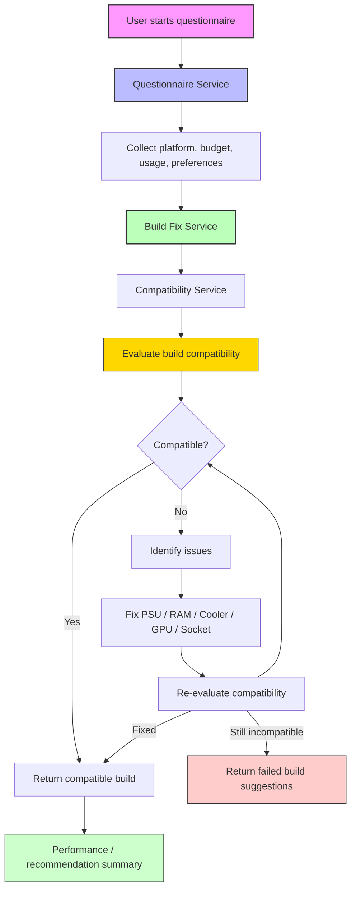

# Build Finder Diagram

This diagram shows the build finder and repair flow used by the application.

## Explanation

1. The user begins a questionnaire flow to capture platform, budget, and usage needs.
2. `Questionnaire Service` gathers answers and passes them to the build finder logic.
3. `Build Fix Service` evaluates the current build through `Compatibility Service`.
4. If the build is compatible, it returns a compatible build summary.
5. If not, it identifies issues and applies repair strategies.
6. The build is re-evaluated until it is fixed or no safe fixes remain.
7. The final result includes either a fixed compatible build or guidance for the user.
