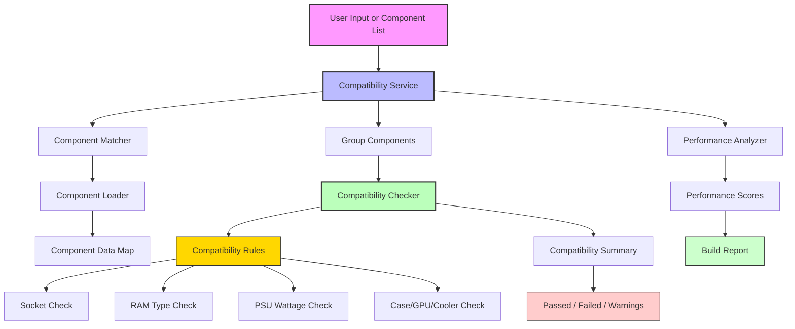

# Compatibility Determination Diagram

This diagram shows how compatibility is determined in the system.

## Explanation

1. `Compatibility Service` receives either raw user input or a list of loaded components.
2. If the input is text, `Component Matcher` resolves it against the available component data.
3. `Component Loader` provides the normalized component data needed for matching and checking.
4. `Compatibility Service` groups matched components into categories.
5. `Compatibility Checker` applies rules such as socket matching, RAM type validation, PSU wattage, and case/cooler/gpu fit.
6. The checker returns a final compatibility summary with pass/fail status and warnings.
7. `Performance Analyzer` may also run to attach performance scores and build recommendations.
